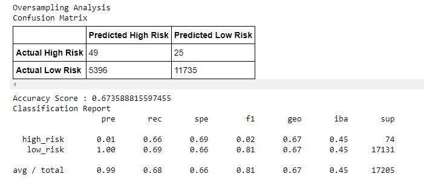
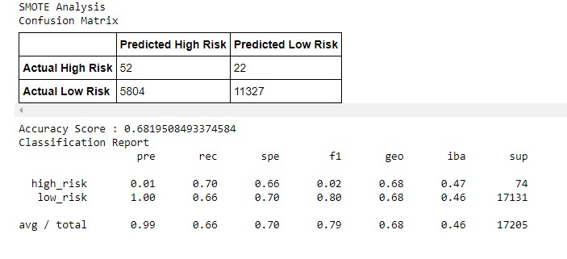
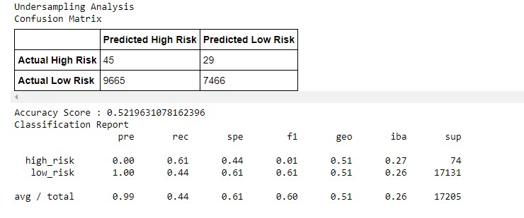
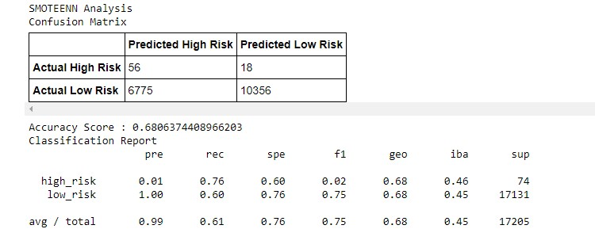
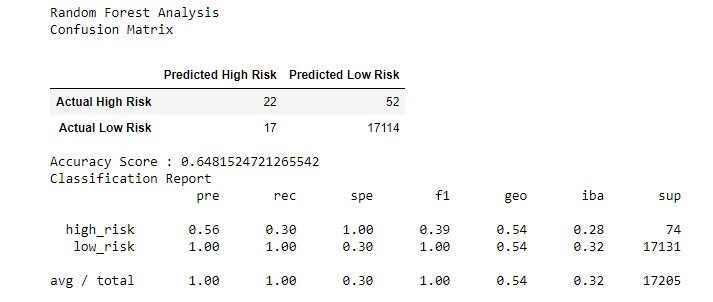
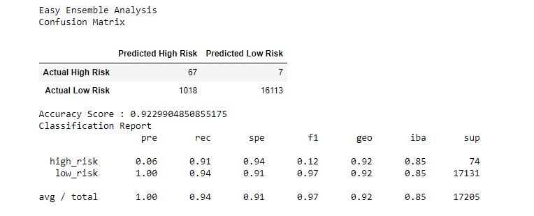

# Credit_Risk_Analysis
## Overview
The purpose of this analysis is to create a supervised machine learning model that could accurately predict credit risk. Six different methods were utilized.

* 1. Naive Random Oversampling
* 2. SMOTE Oversampling
* 3. Cluster Centroid Undersampling
* 4. SMOTEENN Sampling
* 5. Balanced Random Forest Classifying
* 6. Easy Ensemble Classifying

Through each of these methods, the data was split into training and testing datasets. Accuracy scores, confusion matrices and classification reports were compiled in summary form. 

## Deliverable 1
## Use Resampling Models to Predict Credit Risk

### Random Oversampling
* Accuracy Score: 67.4%

### SMOTE Oversampling
* Accuracy Score: 68.2%

## Deliverable 2
## Use the SMOTEENN algorithm to Predict Credit Risk

### Undersampling Analysis
* Accuracy Score: 52.2%

### SMOTEENN Analysis
* Accuracy Score: 68.1%

## Deliverable 3
## Use Ensemble Classifiers to Predict Credit Risk

### Random Forest Analysis
* Accuracy Score: 64.8%

### Easy Ensemble Analysis
* Accuracy Score: 92.3%

## Summary
